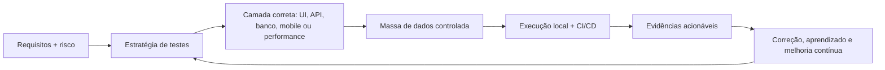

  <h1>Douglas Antonio</h1>
  
<strong>Quality Engineering | QA Automation | Web, API, Mobile, Performance & IA</strong>

  
Engenheiro de Qualidade de Software focado em estratégia de testes, automação ponta a ponta e estabilidade de sistemas.

  
  
  
  

  
  
  
  

## 👋 Sobre

Sou **Engenheiro de Qualidade de Software (QA)** com atuação prática em estratégia de testes, automação Web/E2E, validação de APIs, mobile testing, performance, CI/CD, dados e uso responsável de IA aplicada a QA.

Meu trabalho é transformar risco de produto em **critérios claros, cenários bem modelados, automações confiáveis e evidências que ajudam times a decidir com segurança**. Qualidade, para mim, não é uma etapa no fim do fluxo: é engenharia aplicada desde o refinamento até a decisão de release.

Trago uma base técnica em formação especializada pela **EBAC**, vivência real como QA voluntário na **SouJunior** e uma trajetória anterior em coordenação operacional, padronização de processos, controle de qualidade e melhoria contínua. Essa combinação reforça uma visão prática: estabilidade nasce de processo, código, dados, comunicação e rastreabilidade trabalhando juntos.

> Qualidade madura reduz incerteza, encurta ciclos de correção e protege a experiência de quem usa o produto.

## ⚙️ Como Gero Valor

| Frente | O que faço | Impacto para o produto |
| --- | --- | --- |
| Estratégia de testes | Planejamento orientado a risco, critérios de aceite, BDD/Gherkin, regressão, smoke e exploração | Mais previsibilidade antes de release |
| Automação Web/E2E | Cypress, Playwright, Page Objects/Actions, fixtures, dados dinâmicos e execução multi-browser | Feedback rápido sobre jornadas críticas |
| APIs e contratos | REST, GraphQL, Postman, Insomnia, Swagger/OpenAPI, Cypress API, Playwright API, Pactum e Supertest | Integrações mais confiáveis e diagnóstico mais preciso |
| Mobile testing | Appium, Robot Framework, WebdriverIO, UiAutomator2, Maestro, Android Studio e emuladores | Cobertura de fluxos móveis com evidência técnica |
| Performance | k6 e JMeter para smoke, load, stress, spike, soak, breakpoint, thresholds e gargalos | Visão de resiliência sob carga e degradação |
| Dados e ambientes | SQL, PostgreSQL, MongoDB, fixtures, Faker.js, setup/cleanup e massa sintética validada | Menos flakiness e maior independência entre cenários |
| CI/CD e DevOps | GitHub Actions, GitLab CI, Jenkins, Docker, Git Flow e artefatos de pipeline | Qualidade integrada ao fluxo de entrega |
| Security QA e IA | OWASP Top 10, validações de segurança, OpenAI API, Zod, self-healing auditável e dados sintéticos | Inovação com controle, rastreabilidade e critério técnico |

## 🧰 Stack Principal

**Automação, testes e qualidade**

  
  
  
  
  
  
  
  
  
  

**APIs, performance, dados e ferramentas**

  
  
  
  
  
  
  
  
  
  

**Linguagens, runtime, CI/CD e DevOps**

  
  
  
  
  
  
  
  
  
  
  
  
  
  
  

> Linguagens detectadas nos repositórios e nas fontes profissionais: **JavaScript, TypeScript, Python, Ruby, Robot Framework, Gherkin, HTML, CSS, Shell/Bash, Dockerfile, SQL e Node.js**. Também uso **Bruno/Bru** como apoio para exploração e validação de APIs.

## 🚀 Projetos em Destaque

| Projeto | O que demonstra | Stack |
| --- | --- | --- |
| [QA AI Playwright OpenAI](https://github.com/DouglasAntoni0/automacao-inteligente-qa) | Automação E2E com IA aplicada de forma controlada: massa sintética, validação por contrato, fallback determinístico, self-healing auditável e evidências no relatório | Playwright, TypeScript, OpenAI API, Zod, GitHub Actions |
| [QA E2E Test Suite - SouJunior](https://github.com/DouglasAntoni0/Testes-E2E-SouJunior) | Suíte independente para plataforma real, com arquitetura dual-framework, ~49 cenários, responsividade, acessibilidade, massa compartilhada e bugs reais documentados | Cypress, Playwright, JavaScript, Node.js |
| [Zombie+ Playwright Complete](https://github.com/DouglasAntoni0/playwrightcomplete) | Ecossistema completo de automação para plataforma de streaming, combinando UI, API, banco, fixtures, multi-browser, mobile viewport e evidências de falha | Playwright, JavaScript, PostgreSQL, Docker, GitHub Actions |
| [WebDojo Cypress](https://github.com/DouglasAntoni0/ninjadocypress) | Automação full stack com E2E, API, banco, Docker, Prisma, massa dinâmica, mocks, `cy.task()`, coleção Bruno e documentação técnica | Cypress, Node.js, Express, PostgreSQL, Prisma, Docker |
| [Performance Testing com k6](https://github.com/DouglasAntoni0/Projeto-completo-k6) | Engenharia de performance com smoke, load, stress, spike, soak, breakpoint, WebSocket, thresholds, métricas customizadas e relatórios | k6, JavaScript, REST, WebSocket, GitHub Actions |
| [QAx Mobile](https://github.com/DouglasAntoni0/QAx-Mobile) | Automação mobile Android com interações reais, fluxos de negócio, API local, MongoDB, evidências, CI com emulador e duas stacks de implementação | Appium, Robot Framework, Python, WebdriverIO, MongoDB |
| [AutomateX API Testing](https://github.com/DouglasAntoni0/testes-de-api) | Framework de testes de API em dual-framework, com autenticação, CRUD completo, isolamento de estado, TypeScript-first e pipeline | Cypress, Playwright, TypeScript, GitHub Actions |
| [Pytest Task Manager](https://github.com/DouglasAntoni0/pytest) | Suíte Python cobrindo unidade, integração, API Flask, E2E no navegador, fixtures em camadas, máquina de estados e cobertura 90%+ | Python, Pytest, Flask, Playwright, GitHub Actions |
| [Portfólio Profissional](https://douglasqa.netlify.app/) | Hub visual com projetos, stack, atuação em QA e narrativa profissional focada em qualidade escalável | HTML, CSS, JavaScript, GSAP, Netlify |

## 🧭 Minha Abordagem de Qualidade

- **Automação com intenção:** cada teste precisa justificar seu custo de manutenção e o risco que reduz.
- **Validação pela camada certa:** UI para jornada, API para contrato e regra, banco para estado, performance para resiliência.
- **Dados como parte da arquitetura:** fixtures, factories, limpeza de estado e massa sintética precisam ser previsíveis.
- **Bug report como peça técnica:** contexto, impacto, passos, evidência, ambiente e hipótese aceleram correção.
- **IA com rastreabilidade:** self-healing e geração de massa só fazem sentido quando são explícitos, auditáveis e validados por schema.

## 🏢 Experiência em Destaque

### SouJunior - Engenheiro de Qualidade de Software (QA) | Voluntariado | desde fev/2026

- Atuação em rotinas ágeis com times de produto e desenvolvimento, apoiando validações funcionais, regressivas e exploratórias.
- Estruturação de cenários, roteiros de verificação, critérios de aceite e documentação técnica de inconsistências.
- Construção e manutenção de automações E2E com **Cypress** e **Playwright** para fortalecer a baseline de qualidade.
- Registro de bugs com evidências, impacto e rastreabilidade para melhorar a comunicação entre QA e desenvolvimento.
- Prática com Jira, Trello, Postman, Swagger, Selenium, Git/GitHub, SQL básico, BDD/Gherkin e análise comportamental.

### QA Freelancer e Projetos Técnicos

- Desenvolvimento de automações Web/E2E com Cypress e Playwright, aplicando Page Objects/Actions, fixtures e dados dinâmicos.
- Validação de APIs REST e contratos com Postman, Swagger/OpenAPI, Cypress API e Playwright API.
- Testes mobile com Appium, WebdriverIO, Robot Framework, Android Studio e emuladores.
- Testes de performance com JMeter e k6, incluindo carga, stress, spike, soak, breakpoint e thresholds.
- Integração de suítes em CI/CD com GitHub Actions, GitLab CI, Jenkins e Docker.

### Operações, Qualidade e Melhoria Contínua

Antes da transição para QA, construí uma trajetória em coordenação operacional, gestão de equipes, controle de qualidade, padronização de processos, análise de ocorrências e melhoria contínua.

Essa base aparece diretamente na minha forma de atuar em tecnologia: organização, atenção a detalhes, análise de causa, comunicação entre áreas, priorização por impacto e foco em reduzir falhas repetitivas.

## 🎓 Formação e Evolução Contínua

| Formação / trilha | Ênfase técnica |
| --- | --- |
| **EBAC - Engenharia de Qualidade de Software** | Test strategy, automação Web/API/Mobile, CI/CD, JavaScript, Node.js, Docker, SQL e qualidade ponta a ponta |
| **Playwright Completo** | E2E, API, banco, fixtures, relatórios, multi-browser, Page Objects/Actions e pipelines |
| **Ninja do Cypress** | Cypress E2E/API, Page Objects, Faker.js, Prisma, Express, PostgreSQL, Docker e Mochawesome |
| **Performance com k6** | Smoke, load, stress, spike, soak, breakpoint, WebSocket, thresholds e análise de gargalos |
| **Automação Mobile** | Appium, Robot Framework, WebdriverIO, UiAutomator2, Android Studio, MongoDB e CI com emulador |
| **Cybersecurity / Security QA** | Fundamentos de segurança, OWASP Top 10, riscos, vulnerabilidades, proteção de dados e DevSecOps |
| **Inteligência Artificial** | Python, ML/LLMs, massa dinâmica, dados sintéticos, validação de schema e automação inteligente |
| **TI, lógica e programação** | SDLC, arquitetura de sistemas, banco de dados, lógica, algoritmos e leitura crítica de código |

## 🧩 Competências Complementares

| Categoria | Competências |
| --- | --- |
| Test design | Test Plan, Test Strategy, Test Cases, BDD, Gherkin, Cucumber, critérios de aceite e priorização por risco |
| Tipos de teste | Manual, funcional, regressivo, smoke, sanidade, exploratório, integração, contrato, E2E, mobile, performance e segurança |
| Arquitetura de automação | Page Objects, Actions, fixtures, custom commands, helpers de API, setup/teardown, mocks e relatórios |
| Evidências | Screenshots, traces, vídeos, relatórios HTML, logs, artefatos de pipeline e documentação técnica |
| Dados | Faker.js, fixtures JSON/CSV, SQL, PostgreSQL, MongoDB, massa dinâmica, massa sintética e limpeza de estado |
| Processo | Agile, Scrum, Kanban, Jira, Trello, Git Flow, pull requests, refinamento, critérios de aceite e comunicação técnica |
| Idiomas | Português nativo e inglês técnico/intermediário |

## 📊 GitHub em Números

  

  
  

## 🔎 O Que Você Encontra por Aqui

Este GitHub funciona como um portfólio técnico prático de **Quality Engineering**. Os repositórios mostram diferentes níveis de profundidade:

- automação Web/E2E com Cypress e Playwright;
- testes de API com autenticação, CRUD, contratos, erros e pipelines;
- mobile testing com Appium, Robot Framework, WebdriverIO e emuladores;
- performance engineering com k6 e JMeter;
- qualidade em CI/CD com artefatos e evidências rastreáveis;
- controle de massa de dados com SQL, PostgreSQL, MongoDB, fixtures e factories;
- IA aplicada a QA com geração de massa, validação por schema e self-healing auditável;
- documentação técnica escrita para quem precisa entender, executar e evoluir a suíte.

## 📫 Contato Profissional

  
  
  
  

  <strong>Qualidade bem feita não tenta adivinhar estabilidade. Ela cria evidência para decidir, corrigir e evoluir com confiança.</strong>

  Atualizado em junho de 2026.

  

